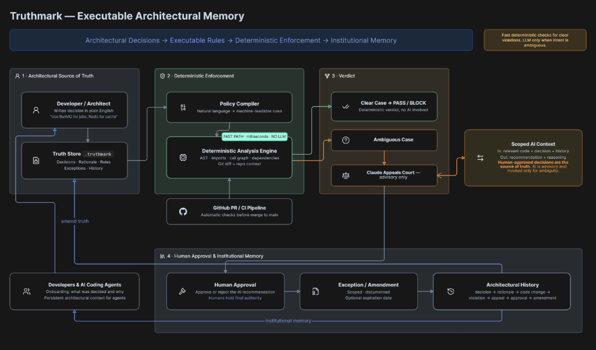
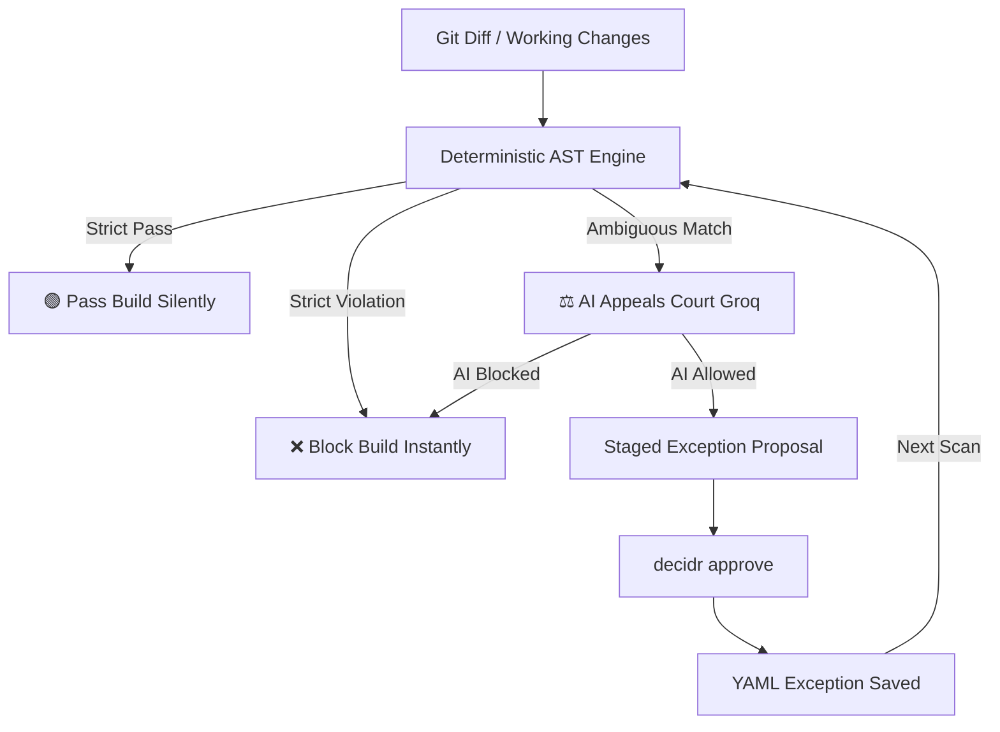

# 📐 Truthmark (Decidr)

> **Executable Architectural Memory & AI Governance Shield for Software Teams.**

Truthmark (CLI name: `decidr`) ensures that your team's architectural decisions become living, executable rules. It validates code compliance locally in milliseconds, escalates ambiguous cases to a Groq-powered AI Appeals Court, and puts control back in the hands of human architects through a source-controlled approval loop.



---

## 🚀 The Architecture

Truthmark uses a **hybrid, deterministic-first governance loop** designed for speed and cost efficiency:



---

## ✨ Features

*   **Sub-20ms Deterministic Check**: Bypasses network and LLM delays for strict passes or explicit violations.
*   **AI Appeals Court**: Grades context and intent of ambiguous code snippets (powered by Groq `openai/gpt-oss-120b`).
*   **Human-in-the-Loop Governance**: AI only suggests policies; exception overrides require human signature and write back to version-controlled YAML files.
*   **Living ASCII Graphs**: Visualize current decisions and exceptions directly in your terminal.
*   **CI/CD Guard**: Seamlessly blocks non-compliant commits via GitHub Actions.

---

## ⚙️ Core Design Principles

*   **Hybrid Deterministic & AI Architecture**: Avoids blindly sending entire codebases to expensive LLMs. Instead, it uses fast, deterministic pattern matching first, escalating to an AI Appeals Court only when rules are ambiguous.
*   **Git Internals Integration**: Interacts directly with Git's diffing engine (`git diff` and working trees) to parse code changes on-the-fly before they reach a shared repository.
*   **Enterprise Governance Engine**: Mimics enterprise-grade governance platforms (like SonarQube, Snyk, or ESLint custom rules) by binding Architectural Decision Records (ADRs) and exception waivers directly to source code.
*   **CI/CD Pipeline Readiness**: Implements standard POSIX exit codes (0 for pass, 1 for violations), enabling it to run as a blocking pre-commit hook or a GitHub Actions pull request gate.
*   **Modular Multi-Layer System Design**: The codebase follows clean architecture principles, separating storage schemas (`repo`), AST/diff extraction (`diffReader`/`patternExtractor`), routing engines (`verdictRouter`), and LLM API integrations (`appeal`).

---

## 🛠️ Getting Started

### 1. Installation
Install project dependencies and link the CLI globally on your system:
```bash
# Install packages
npm install

# Compile TypeScript
npm run build

# Link CLI globally
npm link
```

### 2. Configure Environment
To use the AI Appeals Court, set up your Groq API key:
```bash
export GROQ_API_KEY="your-groq-api-key"
```
*Note: To run the tool completely offline, set `export DECIDR_OFFLINE="true"`.*

---

## 💻 Commands Guide

### `decidr init`
Scaffold the version-controlled database directory structure:
```bash
decidr init
```
This generates the `.decidr/` directory to store your rules, exceptions, and history events.

### `decidr check`
Scan your changes for architectural policy compliance:
```bash
# Check working tree uncommitted changes
decidr check --working

# Check commits range
decidr check --base HEAD~1 --head HEAD
```

### `decidr approve <EXC-ID>`
Interactively review and sign off on a staged exception:
```bash
decidr approve EXC-F79D2B
```
This saves the exception configuration locally as YAML, bypassing future AI reviews.

### `decidr history <ADR-ID>`
Inspect the timeline and audit trail for a decision:
```bash
decidr history ADR-002
```

### `decidr visual`
Render a color-coded ASCII graph of your active rules and overrides:
```bash
decidr visual
```

---

## 📂 Database Structure
All configurations are plain text and version-controlled:
*   `.decidr/decisions/ADR-*.yaml` — Architectural Decision Records.
*   `.decidr/exceptions/EXC-*.yaml` — Expiring exemption rules.
*   `.decidr/history/events.jsonl` — The append-only audit event log ledger.
